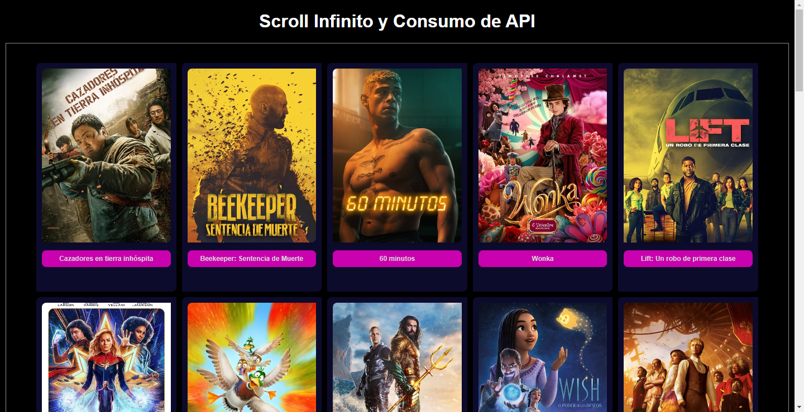

## Scroll Infinito con Consumo de API REST
Este proyecto fue desarrollado con el objetivo de consumir una API REST y mostrar los datos en una página web con scroll infinito. Usando intersection Observer para detectar cuando el usuario llega al final de la página y así cargar más datos. 

### Portada y Pen


- [Ver en CodePen](https://codepen.io/alexisartigas/pen/ExWzZzg)
---

### Tecnologías Utilizadas

- HTML
- CSS
- JavaScript
- API REST - themoviedb.org

### Cómo Ejecutar

1. **Clone el Repositorio:**

    ```bash
    git clone https://github.com/alexisartigas/infinity-scroll-javascript.git
    ```
2. **Registrate en themoviedb.org y obtén tu API Key:**
    - [themoviedb.org](https://www.themoviedb.org/)
3. **Editar el API_KEY en el archivo `app.js`:**
    - Navegue hasta el directorio del proyecto.
    - Abra el archivo `app.js` y reemplace `API_KEY` con su propia clave de API.
    ```javascript
    const API_KEY = 'API_KEY';
    ```
3. **Abra el Archivo `index.html`:**
   - Navegue hasta el directorio del proyecto.
   - Abra el archivo `index.html` en su navegador web preferido.

4. **¡Listo!**
   - Después de abrir el archivo `index.html`, debería tener acceso a la aplicación y poder explorarla.

¡Listo para disfrutar del proyecto! Si encuentras algún problema durante la ejecución, asegúrate de revisar los detalles en el archivo README o la consola del navegador para obtener posibles mensajes de error. ¡Diviértete explorando!

---

#### Autor
 - [Alexis Artigas](https://www.linkedin.com/in/alexis-artigas-3b8855ab/)
